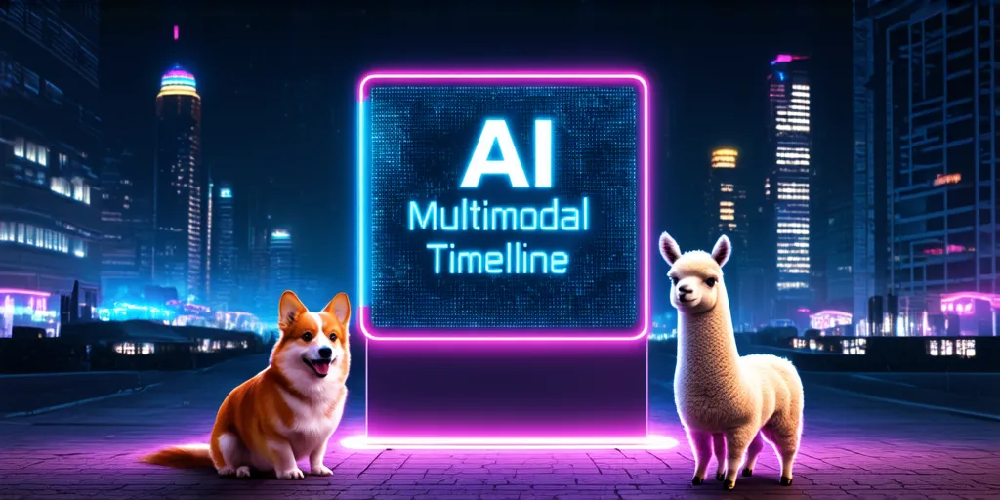

# AI Multimodal Timeline

  

Here we will track the latest AI Multimodal Models, including Multimodal Foundation Model, LLM, Agent, Audio, Image, Video, Music and 3D content. 🔥

## Table of Contents

* [Multimodal Model](#multimodal)
* [LLM](#llm)
* [Agent](#agent)
* [Audio](#audio)
* [Image](#image)
* [Video](#video)
* [Music](#music)
* [3D](#3d)

## Project List

###  Multimodal Model

| Date          | Source                   | Description                                                 |   Paper   |  Model  |
| :------------------------------ | :--------------------------------------------------------------------------------------------------------------------------------------------------------------------------------------------- | :--------------------------------------- | :-----------: | :-------: |
|    2024-06    | [MINT-1T](https://github.com/mlfoundations/MINT-1T)              | Scaling Open-Source Multimodal Data by 10x: A Multimodal Dataset with One Trillion Tokens.            |[arXiv](https://arxiv.org/abs/2406.11271)  |  |
|    2024-06    | [OmniTokenizer](https://github.com/FoundationVision/OmniTokenizer)              | A Joint Image-Video Tokenizer for Visual Generation.            |[arXiv](https://arxiv.org/abs/2406.09399)  |[Website](https://www.wangjunke.info/OmniTokenizer/)  |
|    2024-06    | [ml-4m](https://github.com/apple/ml-4m)              | A framework for training any-to-any multimodal foundation models.            |[arXiv](https://arxiv.org/abs/2406.09406)  |[Website](https://4m.epfl.ch/)  |
|    2024-06    | [VideoLLaMA 2](https://github.com/DAMO-NLP-SG/VideoLLaMA2)              | Advancing Spatial-Temporal Modeling and Audio Understanding in Video-LLMs.            |[arXiv](https://arxiv.org/abs/2406.07476)  |[Hugging Face](https://huggingface.co/DAMO-NLP-SG/VideoLLaMA2-7B)  |
|    2024-05    | [ManyICL](https://github.com/stanfordmlgroup/ManyICL)        | Many-Shot In-Context Learning in Multimodal Foundation Models.            |[arXiv](https://arxiv.org/abs/2405.09798)  |    |
|    2024-05    | [Contrastive ALignment (CAL)](https://github.com/foundation-multimodal-models/CAL)        | Seeing the Image: Prioritizing Visual Correlation by Contrastive Alignment.            |[arXiv](https://arxiv.org/abs/2405.17871)  |    |
|    2024-05    | [Groma](https://github.com/FoundationVision/Groma)                      | Grounded Multimodal Large Language Model with Localized Visual Tokenization.            |[arXiv](https://arxiv.org/abs/2404.13013)  |[Hugging Face](https://huggingface.co/FoundationVision/groma-7b-finetune)  |
|    2024-05    | [CogVLM2](https://github.com/THUDM/CogVLM2)                      | GPT4V-level open-source multi-modal model based on Llama3-8B.            |                                                               |[Hugging Face](https://huggingface.co/THUDM/cogvlm2-llama3-chat-19B)  |
|    2024-05    | [Chameleon](https://github.com/facebookresearch/chameleon)            | Mixed-Modal Early-Fusion Foundation Models.            |[arXiv](https://arxiv.org/abs/2405.09818)  |                                                 |
|    2024-05    | [Lumina-T2X](https://github.com/Alpha-VLLM/Lumina-T2X)                | Transforming Text into Any Modality, Resolution, and Duration via Flow-based Large Diffusion Transformers.            |[arXiv](https://arxiv.org/abs/2405.05945)  |[Hugging Face](https://huggingface.co/Alpha-VLLM/Lumina-Next-T2I)  |
|    2024-05    | [MiniCPM-Llama3-V 2.5](https://github.com/OpenBMB/MiniCPM-V)                | MiniCPM-Llama3-V 2.5 is the latest model in the MiniCPM-V series. The model is built on SigLip-400M and Llama3-8B-Instruct with a total of 8B parameters.            |                                     |[Hugging Face](https://huggingface.co/openbmb/MiniCPM-Llama3-V-2_5)  |
|    2024-05    | [Gemini](https://deepmind.google/technologies/gemini/)                      | Build with state-of-the-art generative models and tools to make AI helpful for everyone.            |                                                               |[API](https://ai.google.dev/)  |
|    2024-05    | [GPT-4o](https://openai.com/index/hello-gpt-4o/)                            | GPT-4o (“o” for “omni”) is a step towards much more natural human-computer interaction—it accepts as input any combination of text, audio, image, and video and generates any combination of text, audio, and image outputs.            |                                                               |[API](https://platform.openai.com/docs/models/gpt-4o)  |
|    2024-04    | [MyGO](https://github.com/zjukg/MyGO)      | Discrete Modality Information as Fine-Grained Tokens for Multi-modal Knowledge Graph Completion.            |[arXiv](https://arxiv.org/abs/2404.09468)  |  |
|    2024-04    | [InternLM-XComposer2](https://github.com/InternLM/InternLM-XComposer)      | InternLM-XComposer2 is a groundbreaking vision-language large model (VLLM) excelling in free-form text-image composition and comprehension.            |[arXiv](https://arxiv.org/abs/2404.06512)  |[Hugging Face](https://huggingface.co/internlm/internlm-xcomposer2-4khd-7b)  |
|    2023-12    | [Tokenize Anything](https://github.com/baaivision/tokenize-anything)      | Tokenize Anything via Prompting.            |[arXiv](https://arxiv.org/abs/2312.09128)  |[Hugging Face](https://huggingface.co/BAAI/tokenize-anything)  |
|    2023-11    | [ShareGPT4V](https://github.com/ShareGPT4Omni/ShareGPT4V)      | Improving Large Multi-Modal Models with Better Captions.            |[arXiv](https://arxiv.org/abs/2311.12793)  |[Hugging Face](https://huggingface.co/Lin-Chen/ShareGPT4V-7B)  |
|    2023-07    | [Emu](https://github.com/baaivision/Emu)      | Emu: Generative Multimodal Models from BAAI.            |[arXiv](https://arxiv.org/abs/2307.05222)  |[Hugging Face](https://huggingface.co/BAAI/Emu)  |
|    2023-05    | [ImageBind](https://github.com/facebookresearch/ImageBind)                | One Embedding Space To Bind Them All.            |[arXiv](https://arxiv.org/abs/2305.05665)  |[Website](https://imagebind.metademolab.com/)  |
|    2022-11    | [EVA](https://github.com/baaivision/EVA)                | EVA: Visual Representation Fantasies from BAAI.                      |[arXiv](https://arxiv.org/abs/2211.07636)  |[Hugging Face](https://huggingface.co/BAAI/EVA)  |

<a href="#table-of-contents">^ Back to Contents ^</a>

###  LLM

| Date          | Source                   | Description                                                 |   Paper   |  Model  |
| :------------------------------------------------------------------------------------------ | :--------------------------------------------------------------------------------------------------------------------------------------------------------------------------------------------- | :----------- | :-----------: | :-------: |
|    2024-06    | [Claude 3.5 Sonnet](https://www.anthropic.com/news/claude-3-5-sonnet)            | Claude 3.5 Sonnet            |                                                               |[API](https://www.anthropic.com/api)  |
|    2024-04    | [Llama 3](https://github.com/meta-llama/llama3)                | Meta Llama 3 is the next generation of our state-of-the-art open source large language model.            |                                     |[Hugging Face](https://huggingface.co/meta-llama)  |
|    2024-03    | [Claude 3](https://www.anthropic.com/claude)                   | Talk with Claude, an AI assistant from Anthropic.            |                                                               |[API](https://www.anthropic.com/api)  |
|    2024-03    | [Grok-1](https://github.com/xai-org/grok-1)                    | The weights and architecture of our 314 billion parameter Mixture-of-Experts model, Grok-1.            |                                                               |[Hugging Face](https://huggingface.co/xai-org/grok-1)  |
|    2023-09    | [Baichuan 2](https://github.com/baichuan-inc/Baichuan2)        | A series of large language models developed by Baichuan Intelligent Technology.            |                                     |[Hugging Face](https://huggingface.co/baichuan-inc)  |
|    2023-07    | [GPT-4](https://openai.com/index/gpt-4/)                                    | GPT-4 is OpenAI’s most advanced system, producing safer and more useful responses.            |                                                               |[API](https://platform.openai.com/docs/models/gpt-4-turbo-and-gpt-4)  |

<a href="#table-of-contents">^ Back to Contents ^</a>

###  Agent

| Date          | Source                   | Description                                                 |   Paper   |  Model  |
| :------------------------------------------------------------------------------------------ | :--------------------------------------------------------------------------------------------------------------------------------------------------------------------------------------------- | :----------- | :-----------: | :-------: |
|    2024-06    | [Mixture of Agents (MoA)](https://github.com/togethercomputer/MoA)                | Mixture-of-Agents Enhances Large Language Model Capabilities.            |[arXiv](https://arxiv.org/abs/2406.04692)  |  |
|    2024-06    | [Buffer of Thoughts](https://github.com/YangLing0818/buffer-of-thought-llm)       | Thought-Augmented Reasoning with Large Language Models.            |[arXiv](https://arxiv.org/abs/2406.04271)  |  |
|    2024-06    | [Translation Agent](https://github.com/andrewyng/translation-agent)               | Agentic translation using reflection workflow.            |                                     |  |
|    2024-06    | [Atomic Agents](https://github.com/KennyVaneetvelde/atomic_agents)                | The Atomic Agents framework is designed to be modular, extensible, and easy to use.            |                                     |  |
|    2024-05    | [Pipecat](https://github.com/pipecat-ai/pipecat)                | Open Source framework for voice and multimodal conversational AI.            |                                     |  |

<a href="#table-of-contents">^ Back to Contents ^</a>

###  Audio
#### Audio/Text-to-Speech
| Date          | Source                   | Description                                                 |   Paper   |  Model  |
| :------------------------------------------------------------------------------------------ | :--------------------------------------------------------------------------------------------------------------------------------------------------------------------------------------------- | :----------- | :-----------: | :-------: |
|    2024-05    | [ChatTTS](https://github.com/2noise/ChatTTS)                     | ChatTTS is a text-to-speech model designed specifically for dialogue scenario such as LLM assistant.            |  | |
|    2023-06    | [StyleTTS 2](https://github.com/yl4579/StyleTTS2)                | Towards Human-Level Text-to-Speech through Style Diffusion and Adversarial Training with Large Speech Language Models.            |[arXiv](https://arxiv.org/abs/2306.07691)  |[Hugging Face](https://huggingface.co/spaces/styletts2/styletts2)  |

#### Audio/Automatic Speech Recognition
| Date          | Source                   | Description                                                 |   Paper   |  Model  |
| :------------------------------------------------------------------------------------------ | :--------------------------------------------------------------------------------------------------------------------------------------------------------------------------------------------- | :----------- | :-----------: | :-------: |
|    2024-05    | [TeleSpeech-ASR](https://github.com/Tele-AI/TeleSpeech-ASR)                | Large speech model-super multi-dialect ASR.            |      |[Hugging Face](https://huggingface.co/Tele-AI/TeleSpeech-ASR1.0)  |
|    2022-12    | [Whisper](https://github.com/openai/whisper)                | Whisper is a general-purpose speech recognition model.            |[arXiv](https://arxiv.org/abs/2212.04356)  |[API](https://platform.openai.com/docs/models/whisper)  |

#### Audio/Audio Generation
| Date          | Source                   | Description                                                 |   Paper   |  Model  |
| :------------------------------------------------------------------------------------------ | :--------------------------------------------------------------------------------------------------------------------------------------------------------------------------------------------- | :----------- | :-----------: | :-------: |
|    2024-06    | [SEE-2-SOUND](https://github.com/see2sound/see2sound)                | Zero-Shot Spatial Environment-to-Spatial Sound.            |[arXiv](https://arxiv.org/abs/2406.07547)  |  |
|    2024-05    | [Make-An-Audio 3](https://github.com/Text-to-Audio/Make-An-Audio-3)             | Transforming Text into Audio via Flow-based Large Diffusion Transformers.            |[arXiv](https://arxiv.org/abs/2305.18474)  |[Hugging Face](https://huggingface.co/AIGC-Audio/Make-An-Audio-3)  |

<a href="#table-of-contents">^ Back to Contents ^</a>

###  Image

| Date          | Source                   | Description                                                 |   Paper   |  Model  |
| :------------------------------------------------------------------------------------------ | :--------------------------------------------------------------------------------------------------------------------------------------------------------------------------------------------- | :----------- | :-----------: | :-------: |
|    2024-06    | [Depth Anything V2](https://github.com/DepthAnything/Depth-Anything-V2)                | Depth Anything V2.            |[arXiv](https://arxiv.org/abs/2406.09414)  |[Hugging Face](https://huggingface.co/depth-anything/Depth-Anything-V2-Base)  |
|    2024-06    | [AutoStudio](https://github.com/donahowe/AutoStudio)                | Crafting Consistent Subjects in Multi-turn Interactive Image Generation.            |[arXiv](https://arxiv.org/abs/2406.01388)  |   |
|    2024-06    | [MimicBrush](https://github.com/ali-vilab/MimicBrush)               | Zero-shot Image Editing with Reference Imitation.            |[arXiv](https://arxiv.org/abs/2406.07547)  |[Hugging Face](https://huggingface.co/xichenhku/MimicBrush)  |
|    2024-06    | [LlamaGen](https://github.com/FoundationVision/LlamaGen)            | Autoregressive Model Beats Diffusion: Llama for Scalable Image Generation.            |[arXiv](https://arxiv.org/abs/2406.06525)  |[Hugging Face](https://huggingface.co/FoundationVision/LlamaGen)  |
|    2024-05    | [Omost](https://github.com/lllyasviel/Omost)                        | Omost is a project to convert LLM's coding capability to image generation (or more accurately, image composing) capability.            |     |[Hugging Face](https://huggingface.co/spaces/lllyasviel/Omost)  |
|    2024-05    | [Hunyuan-DiT](https://github.com/Tencent/HunyuanDiT)                | A Powerful Multi-Resolution Diffusion Transformer with Fine-Grained Chinese Understanding.            |[arXiv](https://arxiv.org/abs/2405.08748)  |[Hugging Face](https://huggingface.co/Tencent-Hunyuan/HunyuanDiT)  |
|    2023-10    | [DALL·E 3](https://openai.com/index/dall-e-3/)                      | DALL·E is a AI system that can create realistic images and art from a description in natural language.            |     |[API](https://platform.openai.com/docs/models/dall-e)  |

<a href="#table-of-contents">^ Back to Contents ^</a>

###  Video

| Date          | Source                   | Description                                                 |   Paper   |  Model  |
| :------------------------------------------------------------------------------------------ | :--------------------------------------------------------------------------------------------------------------------------------------------------------------------------------------------- | :----------- | :-----------: | :-------: |
|    2024-05    | [Video-MME](https://github.com/BradyFU/Video-MME)                                              | The First-Ever Comprehensive Evaluation Benchmark of Multi-modal LLMs in Video Analysis.            |  |                             |
|    2024-05    | [MotionLLM](https://github.com/IDEA-Research/MotionLLM)                                              | Understanding Human Behaviors from Human Motions and Videos.            |[arXiv](https://arxiv.org/abs/2405.20340)  |                             |
|    2024-05    | [Vidu](https://www.vidu.io/)                                              | Vidu: a Highly Consistent, Dynamic and Skilled Text-to-Video Generator with Diffusion Models.            |[arXiv](https://arxiv.org/abs/2405.04233)  |                             |
|    2024-02    | [Sora](https://openai.com/index/sora/)                                    | Sora is an AI model that can create realistic and imaginative scenes from text instructions.            |[Technical Report](https://openai.com/index/video-generation-models-as-world-simulators/)  |                             |
|    2023-11    | [Pika](https://pika.art/home)                                             | Pika is the idea-to-video platform that sets your creativity in motion.            |     |                             |
|    2023-03    | [Runway](https://runwayml.com/)                                           | Runway is an applied AI research company shaping the next era of art, entertainment and human creativity.            |     |                             |

<a href="#table-of-contents">^ Back to Contents ^</a>

###  Music

| Date          | Source                   | Description                                                 |   Paper   |  Model  |
| :------------------------------------------------------------------------------------------ | :--------------------------------------------------------------------------------------------------------------------------------------------------------------------------------------------- | :----------- | :-----------: | :-------: |
|    2024-04    | [Udio](https://www.udio.com/)                | Udio - AI Music Generator                |                                                                                      |[Website](https://www.udio.com/)  |
|    2023-12    | [Suno](https://suno.com/)                | Suno is building a future where anyone can make great music.            |                                                                                      |[Website](https://suno.com/)  |
|    2023-12    | [Soundry AI](https://soundry.ai/)        | Generative AI tools including text-to-sound and infinite sample packs.            |                                                                                      |[Website](https://soundry.ai/)  |
|    2023-12    | [Sonauto](https://sonauto.ai/Home)        | Sonauto is an AI music editor that turns prompts, lyrics, or melodies into full songs in any style.            |                                                        |[Website](https://sonauto.ai/Home)  |

<a href="#table-of-contents">^ Back to Contents ^</a>

###  3D

| Date          | Source                   | Description                                                 |   Paper   |  Model  |
| :------------------------------------------------------------------------------------------ | :--------------------------------------------------------------------------------------------------------------------------------------------------------------------------------------------- | :----------- | :-----------: | :-------: |
|    2024-06    | [Unique3D](https://github.com/AiuniAI/Unique3D)      | High-Quality and Efficient 3D Mesh Generation from a Single Image.            |[arXiv](https://arxiv.org/abs/2405.20343)  |[Hugging Face](https://huggingface.co/Wuvin/Unique3D)  |
|    2024-06    | [DreamGaussian4D](https://github.com/jiawei-ren/dreamgaussian4d)      | Generative 4D Gaussian Splatting.            |[arXiv](https://arxiv.org/abs/2312.17142)  |[Hugging Face](https://huggingface.co/spaces/jiawei011/dreamgaussian4d)  |
|    2024-03    | [GaussianCube](https://github.com/GaussianCube/GaussianCube)          | A Structured and Explicit Radiance Representation for 3D Generative Modeling.            |[arXiv](https://arxiv.org/abs/2403.19655)  |[Hugging Face](https://huggingface.co/BwZhang/GaussianCube-OmniObject3D-v1.0)  |
|    2024-03    | [TripoSR](https://github.com/VAST-AI-Research/TripoSR)                | Fast 3D Object Reconstruction from a Single Image.            |[arXiv](https://arxiv.org/abs/2403.02151)  |[Hugging Face](https://huggingface.co/spaces/stabilityai/TripoSR)  |

<a href="#table-of-contents">^ Back to Contents ^</a>

